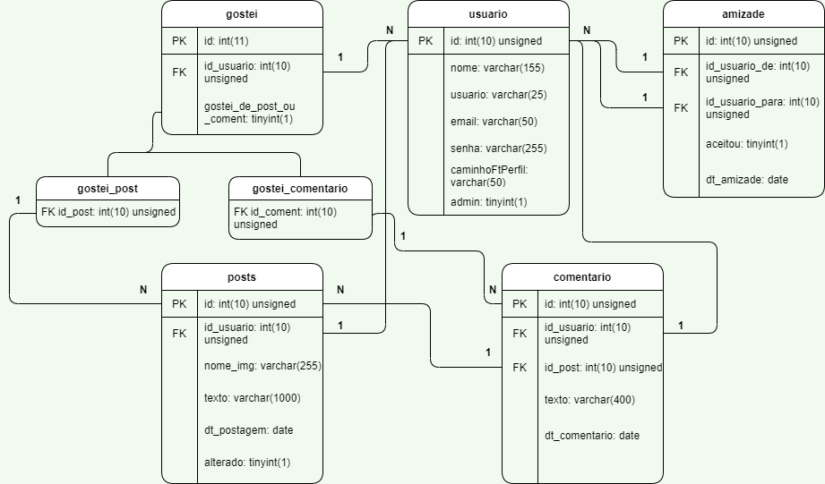

# Equilibrium

Projeto Final do Curso Técnico Integrado de Desenvolvimento de Sistemas - Colégio Pedro II - Campus Duque de Caxias

**Integrantes:**
 - Ana Carolina Carvalho de Sá
 - Maria Victória de Aguiar Medina
 - Felipe Willian Lima Martins

## Descrição do Projeto
### Tipo de sistema
Rede social

### Tema da rede social
Qualidade de vida e vida saudável
 
### Descrição do público alvo
Aberto para todas as idades que buscam registrar ou
descobrir hábitos de vida mais saudáveis para sua rotina.

### Motivação para criação da rede social
Possibilitar o encontro de sugestões, discussões e compartlhamentos de ideias sobre ações e hábitos relativos à busca de uma vida saudável nos âmbitos de alimentação, atividade física, meditação e autocuidado, somando e equilibrando todos esses aspectos em prol da busca do bem estar físico e mental dos usuários.

## Documentação

- [Manual do Usuário](manual.md)
- [Requisitos](requisitos.md)
- [Casos de Uso](casos-de-uso.md)
- [Apresentação](apresentacao.pdf)

**Diagrama de Classes**

**Modelagem do Banco de Dados**

