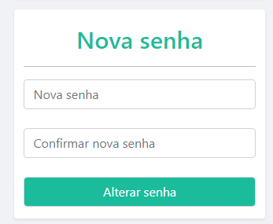

# Manual do Usuário

**Lista das Funcionalidades:**

 - [Cadastro](#Cadastro)
 - [Login](#Login)
 - [Encerramento de sessão](#Encerramento-de-sessão)
 - [Edição de perfil](#Edição-de-perfil)
 - [Troca de senha](#Troca-de-senha)
 - [Timeline de posts pessoais](#Timeline-de-posts-pessoais)
 - [Privilégios de administrador](#Privilégios-de-administrador)
 - [Publicação de posts](#Publicação-de-posts)
 - [Exclusão de posts](#Exclusão-de-posts)
 - [Edição de posts](#Edição-de-posts)
 - [Publicação de comentários](#Publicação-de-comentários)
 - [Exclusão de comentários](#Exclusão-de-comentários)
 - [Edição de comentários](#Edição-de-comentários)
 - [Curtir ou descurtir post](#Curtir-ou-descurtir-post)
 - [Curtir ou descurtir comentário](#Curtir-ou-descurtir-comentário)

## Cadastro

Para o usuário se cadastrar, este deve se dirigir a página inicial (index.php) e clicar no botão “Cadastrar” que está abaixo do painel de login. No painel de cadastro, haverá campos como nome de usuário e email. O usuário deverá preencher todos corretamente, já que, no caso de algum campo ser enviado incorretamente, o sistema enviará um aviso de erro ao usuário. Se todos os campos estiverem corretos, o sistema redireciona o usuário para o painel de login na página inicial.

## Login

Para o usuário se logar, este deve se dirigir a página inicial (index.php). Na página de cadastro, haverá os campos "email ou nome de usuário" e "senha". O usuário deverá preenchê-los de acordo com o email ou nome de usuário e senha que ele cadastrou anteriormente e clicar no botão “Entrar”. No caso dos campos estiverem vazios ou incorretos, o sistema enviará um aviso de erro ao usuário. Se não houver nenhum erro, ele será redirecionado para a página pessoal de publicação de postagens.

## Encerramento de sessão

Qualquer usuário poderá encerrar sua sessão. Para isto, em qualquer página, ele deverá se dirigir ao seu nome cadastrado no canto superior direito da tela. Ao clicar, uma lista com a opção "Sair" aparecerá. Basta o usuário clicar nisto e sua sessão será encerrada.

## Edição de perfil

O usuário tem a opção de editar os seus dados cadastrados. Para isto, já logado, ele deve, em qualquer página do sistema, clicar no botão com o seu nome cadastrado localizado no canto superior direito. Ao clicar nisto, uma lista com a opção "Perfil" e o usuário, ao clicar nela, será redirecionado para uma página de edição daquele perfil (pagPublicacao.php).

Na página de edição, o usuário poderá trocar os dados de seu interesse e, após isto, ele deve clicar no botão “Salvar” localizado abaixo dos campos com os dados pessoais. Caso haja algum erro, o sistema enviará um aviso de erro ao usuário. Se não houver nenhum erro, o sistema atualizará a página de edição com os dados corrigidos.

## Troca de senha

O usuário também tem a opção de trocar a sua senha. Para isto, ele deve fazer os passos anteriores, contudo, este deve seguir para a seção "Nova senha" embaixo da seção "Alterar perfil". Nesta área, ele deve preencher os campos senha, confirmar senha e clicar no botão “Alterar senha” abaixo da seção. Caso haja alguma exceção, o sistema enviará um aviso de erro ao usuário. Se não houver nenhum erro, o sistema também transportará o usuário para a página com os dados pessoais impressos.

## Timeline de posts pessoais

Qualquer usuário poderá ver os próprios posts na página de publicações. Para isto, ele pode clicar na logo da "Equilibrium" localizado em qualquer página disponível ou, quando logar ou entrar no site, ele já será redirecionado para esta página com a timeline daquele usuário.

## Privilégios de administrador
Qualquer administrador terá certos privilégios reservados a este grupo. Para usá-los, este deve seguir o mesmo processo de encerramento de sessão. Porém, este deverá clicar na opção "Painel administrador". Ao clicar nisto, ele será redirecionado para a página de administrador (pagAdmin.php).

Nesta página, haverá uma lista com todos os usuários cadastrados no sistema. Abaixo desta lista, haverá quatro botões que fazem as seguintes ações ao serem clicados:
"Promover a admin": Concede as prerrogativas de administrador ao usuário selecionado.
"Retirar admin": Retira as prerrogativas de administrador do usuário selecionado.
"Editar usuário": Redireciona o administrador para a página de edição de perfil daquele usuário selecionado. Basta o admin seguir todos o processo de edição de perfil para editar os dados do usuário selecionado.
"Excluir usuário": Exclui o usuário selecionado do sistema.

## Publicação de posts

Na página inicial após o login, haverá um painel com uma caixa de texto. Nesta caixa, o usuário escreverá o que deseja publicar. Ele também poderá enviar uma imagem atrelada ao post ao clicar no ícone de câmera, localizado no canto inferior direito do painel de publicação, e selecionar uma foto dos arquivos do computador deste. Finalmente, para publicar o post, basta clicar no botão "Publicar" localizado no canto inferior esquerdo do painel de publicação. Se tudo der certo, o sistema armazenará aquele post e atualizará a timeline do usuário com aquele post recém-publicado.

## Exclusão de posts

Há dois locais onde o usuário pode excluir a sua publicação. Na sua própia timeline na página de publicação, o usuário deverá localizar o post que deseja excluir. Após isto, ele deverá se dirigir ao canto inferior esquerdo do post e clicar no ícone de três pontos. Uma lista com a opção "Excluir postagem" surgirá. Basta o usuário clicar nesta opção e o sistema atualizará a timeline sem aquele post. O usuário também poderá excluir a sua postagem ao pesquisar o nome do seu usuário. O usuário será redirecionado para uma timeline com os seus posts. Se o usuário seguir o mesmo processo anterior, ele poderá excluir o seu post.

O administrador também poderá excluir a postagem. Para isto, ele deve pesquisar o perfil do usuário. O sistema disponibilizará a timeline daquele usuário. Com isto, o administrador deve escolher um post e, finalmente, seguir os passos citados para excluir o post selecionado.

## Edição de posts

Qualquer usuário poderá editar os próprios posts. Para tal, ele deverá seguir os passos da funcionalidade anterior. Porém, desta vez, ele deverá clicar na opção "Alterar postagem". Logo após isto, ele será direcionado para uma página específica de edição de posts (pagAlterarPost.php). Lá, ele poderá editar o que escreveu, bem como trocar a foto através do mesmo processo apresentado na seção de publicação de posts. Quando terminar, o usuário deverá clicar em "Alterar". O sistema atualizará aquele post e redirecionará o usuário para a página onde estava.

## Publicação de comentários

Em cada postagem, há um espaço para comentários. Se o usuário quiser comentar, este deverá localizar o post na timeline do usuário dono do post, descer até o painel de comentários (abaixo do painel do post) e escrever na caixa de texto reservada para isto. Quando terminar, o usuário deverá clicar no botão "Comentar". O sistema atualizará a página e, no painel de comentários, constará o nome, bem como o comentário daquele usuário.

Vale lembrar que qualquer usuário pode comentar no post de qualquer outro usuário. Este, para isto, deve procurar o perfil do usuário, localizar o post e seguir o passo-a-passo citado no parágrafo anterior.

## Exclusão de comentários

Cada comentário possui, no final do comentário, um ícone de três pontos. Se o usuário quiser excluir o seu comentário, é necessário que ele clique nestes três pontos. Uma lista com a opção "Excluir comentário" aparecerá. Se o usuário clicar nesta opção, o sistema atualizará o painel de comentários daquele post sem o comentário excluído.

O administrador também poderá excluir os comentários. Se este procurar o perfil do usuário, o sistema disponibilizará a timeline deste usuário com os posts e seus respectivos comentários. O administrador deverá localizar o post do comentário que deseja excluir. Depois, ele deverá seguir os mesmo processo citado no parágrafo anterior.

## Edição de comentários

Qualquer usuário poderá editar o própio comentário. Basta ele seguir o mesmo processo de exclusão de comentários. Todavia, este deverá clicar na opção "Alterar comentário". Após isto, o sistema irá redirecionar o usuário para uma pagina específica de edição de comentários. Lá, ele deverá seguir o mesmo processo de publicação de comentários e, por fim, clicar no botão "Comentar". O sistema vai redirecionar o usuário para o post de origem com o comentário atualizado. O mesmo processo também vale quando você pesquisa o seu comentário na timeline de usuários terceiros.

## Curtir ou descurtir post

Aqui, para curtir ou descurtir um post, você dever procurar o post desejado em sua timeline ou na timeline de um terceiro ao pesquisar o nome de usuário dele. No canto inferior esquerdo e abaixo da caixa de texto do post, você deverá clicar no ícone típico de curtida. Ao clicar, o sistema atualizará a página com a sua curtida naquele post. Se você clicar no ícone referido novamente, o sistema atualizará a página com aquele post sem a sua curtida.

## Curtir ou descurtir comentário

O mesmo processo de curtir ou descurtir o post também vale para o comentário. Todavia, você deverá localizar o comentário que deseja curtir ou descurtir.

